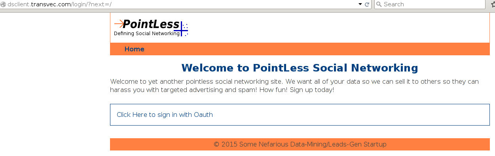

.. Oauth2 Provider documentation master file, created by
   sphinx-quickstart2 on Thu Dec 10 10:47:35 2015.
   You can adapt this file completely to your liking, but it should at least
   contain the root `toctree` directive.

CSC380 Project: Oauth2 Provider Documentation
=============================================

.. toctree::
   :maxdepth: 2
   

Introduction
------------

For demonstration purposes, we have made our OAuth2 provider available online as
well as a demo client. Once a client is configured, it can use a provider for
authentication and authorization. Here's how it works:

Step 1 - Register your app/client with the OAuth provider
*********************************************************

   The endpoint to register a new app is: http://ds.transvec.com/client/new
   You should use an UUID or some sort of Hash as a unique ClientID. Also provide
   a secure client secret and a name for your app/client. The clientRedirectUrl
   is the url for the endpoint of your client that recieves a code to use to complete
   the Oauth authentication process

Step 2 - Create a new user account on the provider 
**************************************************

   Go to http://ds.transvec.com/user/new and create a new user.

Step 3 - Set up the client/consumer 
***********************************

   The client/consumer also needs to 'know' about the clientID and client secret created
   in the previous step. When the login link is clicked, the client will use the endpoints
   of the provider to authenticate the user and retrieve a code which is then used
   by the client to request a token through a 'backchannel'. This process begins when
   the login link is clicked. Our demo client is at http://dsclient.transvec.com

Step 4 - User authentication on the provider 
********************************************

   The user will be prompted for identification (username/password) for authentication
   on the Oauth Provider's site. Once the user is logs in and verifies that they wish
   to share information with the client, they are redirected to the client using the
   link provided to the provider in step 1.

Step 5 - User is logged in on client using credentials from Oauth Provider
**************************************************************************

   The client then uses the code to request a token via a 'backchannel' (i.e. REST call NOT
   transmitted via the browser, but server to server). Once this is successful, the user is
   authenticated and logged in on the client. Note that this particular demo client creates
   a new user account on-the-fly for Oauth users it doesn't already have in its database

Access API
**************************************************************************

  Add the previously acquired access token to the Authorization header in an http request.
  "Authorization: Bearer TOKENSTRING"
  The API is located at http://ds.transvec.com/api/user.
  The Api will return an object of user data that the token has permission to.

